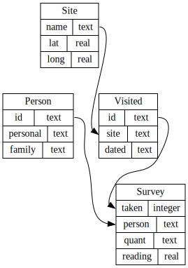

In order to submit our data to a web site
that aggregates historical meteorological data,
we might need to format it as
latitude, longitude, date, quantity, and reading.
However,
our latitudes and longitudes are in the `Site` table,
while the dates of measurements are in the `Visited` table
and the readings themselves are in the `Survey` table.
We need to combine these tables somehow.

This figure shows the relations between the tables:

The SQL command to do this is `JOIN`.
To see how it works,
let's start by joining the `Site` and `Visited` tables:

~~~
SELECT * FROM Site JOIN Visited;
~~~
{: .sql}

|name |lat   |long   |id   |site  |dated     |
|-----|------|-------|-----|------|----------|
|DR-1 |-49.85|-128.57|619  |DR-1  |1927-02-08|
|DR-1 |-49.85|-128.57|622  |DR-1  |1927-02-10|
|DR-1 |-49.85|-128.57|734  |DR-3  |1930-01-07|
|DR-1 |-49.85|-128.57|735  |DR-3  |1930-01-12|
|DR-1 |-49.85|-128.57|751  |DR-3  |1930-02-26|
|DR-1 |-49.85|-128.57|752  |DR-3  |-null-    |
|DR-1 |-49.85|-128.57|837  |MSK-4 |1932-01-14|
|DR-1 |-49.85|-128.57|844  |DR-1  |1932-03-22|
|DR-3 |-47.15|-126.72|619  |DR-1  |1927-02-08|
|DR-3 |-47.15|-126.72|622  |DR-1  |1927-02-10|
|DR-3 |-47.15|-126.72|734  |DR-3  |1930-01-07|
|DR-3 |-47.15|-126.72|735  |DR-3  |1930-01-12|
|DR-3 |-47.15|-126.72|751  |DR-3  |1930-02-26|
|DR-3 |-47.15|-126.72|752  |DR-3  |-null-    |
|DR-3 |-47.15|-126.72|837  |MSK-4 |1932-01-14|
|DR-3 |-47.15|-126.72|844  |DR-1  |1932-03-22|
|MSK-4|-48.87|-123.4 |619  |DR-1  |1927-02-08|
|MSK-4|-48.87|-123.4 |622  |DR-1  |1927-02-10|
|MSK-4|-48.87|-123.4 |734  |DR-3  |1930-01-07|
|MSK-4|-48.87|-123.4 |735  |DR-3  |1930-01-12|
|MSK-4|-48.87|-123.4 |751  |DR-3  |1930-02-26|
|MSK-4|-48.87|-123.4 |752  |DR-3  |-null-    |
|MSK-4|-48.87|-123.4 |837  |MSK-4 |1932-01-14|
|MSK-4|-48.87|-123.4 |844  |DR-1  |1932-03-22|

`JOIN` creates
the [cross product]({{ page.root }}#cross-product)
of two tables,
i.e.,
it joins each record of one table with each record of the other table
to give all possible combinations.
Since there are three records in `Site`
and eight in `Visited`,
the join's output has 24 records (3 * 8 = 24) .
And since each table has three fields,
the output has six fields (3 + 3 = 6).

What the join *hasn't* done is
figure out if the records being joined have anything to do with each other.
It has no way of knowing whether they do or not until we tell it how.
To do that,
we add a clause specifying that
we're only interested in combinations that have the same site name,
thus we need to use a filter:

~~~
SELECT * FROM Site JOIN Visited ON Site.name = Visited.site;
~~~
{: .sql}

|name |lat   |long   |id   |site |dated     |
|-----|------|-------|-----|-----|----------|
|DR-1 |-49.85|-128.57|619  |DR-1 |1927-02-08|
|DR-1 |-49.85|-128.57|622  |DR-1 |1927-02-10|
|DR-1 |-49.85|-128.57|844  |DR-1 |1932-03-22|
|DR-3 |-47.15|-126.72|734  |DR-3 |1930-01-07|
|DR-3 |-47.15|-126.72|735  |DR-3 |1930-01-12|
|DR-3 |-47.15|-126.72|751  |DR-3 |1930-02-26|
|DR-3 |-47.15|-126.72|752  |DR-3 |-null-    |
|MSK-4|-48.87|-123.4 |837  |MSK-4|1932-01-14|

`ON` is very similar to `WHERE`,
and for all the queries in this lesson you can use them interchangeably.
There are differences in how they affect [outer joins][outer],
but that's beyond the scope of this lesson.
Once we add this to our query,
the database manager throws away records
that combined information about two different sites,
leaving us with just the ones we want.

Notice that we used `Table.field` to specify field names
in the output of the join.
We do this because tables can have fields with the same name,
and we need to be specific which ones we're talking about.
For example,
if we joined the `Person` and `Visited` tables,
the result would inherit a field called `id`
from each of the original tables.

We can now use the same dotted notation
to select the three columns we actually want
out of our join:

~~~
SELECT Site.lat, Site.long, Visited.dated
FROM   Site JOIN Visited
ON     Site.name = Visited.site;
~~~
{: .sql}

|lat   |long   |dated     |
|------|-------|----------|
|-49.85|-128.57|1927-02-08|
|-49.85|-128.57|1927-02-10|
|-49.85|-128.57|1932-03-22|
|-47.15|-126.72|-null-    |
|-47.15|-126.72|1930-01-12|
|-47.15|-126.72|1930-02-26|
|-47.15|-126.72|1930-01-07|
|-48.87|-123.4 |1932-01-14|

If joining two tables is good,
joining many tables must be better.
In fact,
we can join any number of tables
simply by adding more `JOIN` clauses to our query,
and more `ON` tests to filter out combinations of records
that don't make sense:

~~~
SELECT Site.lat, Site.long, Visited.dated, Survey.quant, Survey.reading
FROM   Site JOIN Visited JOIN Survey
ON     Site.name = Visited.site
AND    Visited.id = Survey.taken
AND    Visited.dated IS NOT NULL;
~~~
{: .sql}

|lat   |long   |dated     |quant|reading|
|------|-------|----------|-----|-------|
|-49.85|-128.57|1927-02-08|rad  |9.82   |
|-49.85|-128.57|1927-02-08|sal  |0.13   |
|-49.85|-128.57|1927-02-10|rad  |7.8    |
|-49.85|-128.57|1927-02-10|sal  |0.09   |
|-47.15|-126.72|1930-01-07|rad  |8.41   |
|-47.15|-126.72|1930-01-07|sal  |0.05   |
|-47.15|-126.72|1930-01-07|temp |-21.5  |
|-47.15|-126.72|1930-01-12|rad  |7.22   |
|-47.15|-126.72|1930-01-12|sal  |0.06   |
|-47.15|-126.72|1930-01-12|temp |-26.0  |
|-47.15|-126.72|1930-02-26|rad  |4.35   |
|-47.15|-126.72|1930-02-26|sal  |0.1    |
|-47.15|-126.72|1930-02-26|temp |-18.5  |
|-48.87|-123.4 |1932-01-14|rad  |1.46   |
|-48.87|-123.4 |1932-01-14|sal  |0.21   |
|-48.87|-123.4 |1932-01-14|sal  |22.5   |
|-49.85|-128.57|1932-03-22|rad  |11.25  |

We can tell which records from `Site`, `Visited`, and `Survey`
correspond with each other
because those tables contain
[primary keys]({{ page.root }}#primary-key)
and [foreign keys]({{ page.root }}#foreign-key).
A primary key is a value,
or combination of values,
that uniquely identifies each record in a table.
A foreign key is a value (or combination of values) from one table
that identifies a unique record in another table.
Another way of saying this is that
a foreign key is the primary key of one table
that appears in some other table.
In our database,
`Person.id` is the primary key in the `Person` table,
while `Survey.person` is a foreign key
relating the `Survey` table's entries
to entries in `Person`.

Most database designers believe that
every table should have a well-defined primary key.
They also believe that this key should be separate from the data itself,
so that if we ever need to change the data,
we only need to make one change in one place.
One easy way to do this is
to create an arbitrary, unique ID for each record
as we add it to the database.
This is actually very common:
those IDs have names like "student numbers" and "patient numbers",
and they almost always turn out to have originally been
a unique record identifier in some database system or other.
As the query below demonstrates,
SQLite [automatically numbers records][rowid] as they're added to tables,
and we can use those record numbers in queries:

~~~
SELECT rowid, * FROM Person;
~~~
{: .sql}

|rowid|id      |personal |family  |
|-----|--------|---------|--------|
|1    |dyer    |William  |Dyer    |
|2    |pb      |Frank    |Pabodie |
|3    |lake    |Anderson |Lake    |
|4    |roe     |Valentina|Roerich |
|5    |danforth|Frank    |Danforth|

> ## Listing Radiation Readings
>
> Write a query that lists all radiation readings from the DR-1 site.
 > > ## Solution
 > > 
 > > ~~~
 > > SELECT Survey.reading 
 > > FROM Site JOIN Visited JOIN Survey 
 > > ON Site.name = Visited.site
 > > AND Visited.id = Survey.taken
 > > WHERE Site.name = 'DR-1' 
 > > AND Survey.quant = 'rad';
 > > ~~~
 > > {: .sql}
 > >
 > > |reading   |
 > > |----------|
 > > |9.82      |
 > > |7.8       |
 > > |11.25     |
 > {: .solution}
{: .challenge}

> ## Where's Frank?
>
> Write a query that lists all sites visited by people named "Frank".
 > > ## Solution
 > > 
 > > ~~~
 > > SELECT DISTINCT Site.name
 > > FROM Site JOIN Visited JOIN Survey JOIN Person
 > > ON Site.name = Visited.site
 > > AND Visited.id = Survey.taken
 > > AND Survey.person = Person.id
 > > WHERE Person.personal = 'Frank';
 > > ~~~
 > > {: .sql}
 > >
 > > |name   |
 > > |-------|
 > > |DR-3   |
 > {: .solution}
{: .challenge}

> ## Reading Queries
>
> Describe in your own words what the following query produces:
>
> ~~~
> SELECT Site.name FROM Site JOIN Visited
> ON Site.lat < -49.0 AND Site.name = Visited.site AND Visited.dated >= '1932-01-01';
> ~~~
> {: .sql}
{: .challenge}

> ## Who Has Been Where?
>
> Write a query that shows each site with exact location (lat, long) ordered by visited date,
> followed by personal name and family name of the person who visited the site
> and the type of measurement taken and its reading. Please avoid all null values.
> Tip: you should get 15 records with 8 fields.
 > > ## Solution
 > > 
 > > ~~~
 > > SELECT Site.name, Site.lat, Site.long, Person.personal, Person.family, Survey.quant, Survey.reading, Visited.dated
 > > FROM Site JOIN Visited JOIN Survey JOIN Person
 > > ON Site.name = Visited.site
 > > AND Visited.id = Survey.taken
 > > AND Survey.person = Person.id
 > > WHERE Survey.person IS NOT NULL
 > > AND Visited.dated IS NOT NULL
 > > ORDER BY Visited.dated;
 > > ~~~
 > > {: .sql}
 > >
 > > name   |  lat        |  long       |  personal   | family   | quant     | reading   |     dated
 > >--------|-------------|-------------|-------------|----------|-----------|-----------|-----------
 > >DR-1    |    -49.85   |   -128.57   |  William    | Dyer     |   rad     |    9.82   |   1927-02-08
 > >DR-1    |    -49.85   |   -128.57   |  William    | Dyer     |   sal     |    0.13   |   1927-02-08
 > >DR-1    |    -49.85   |   -128.57   |  William    | Dyer     |   rad     |    7.8    |   1927-02-10
 > >DR-1    |    -49.85   |   -128.57   |  William    | Dyer     |   sal     |    0.09   |   1927-02-10
 > >DR-3    |    -47.15   |   -126.72   |  Anderson   | Lake     |   sal     |    0.05   |   1930-01-07
 > >DR-3    |    -47.15   |   -126.72   |  Frank      | Pabodie  |   rad     |    8.41   |   1930-01-07
 > >DR-3    |    -47.15   |   -126.72   |  Frank      | Pabodie  |   temp    |    -21.5  |   1930-01-07
 > >DR-3    |    -47.15   |   -126.72   |  Frank      | Pabodie  |   rad     |    7.22   |   1930-01-12
 > >DR-3    |    -47.15   |   -126.72   |  Anderson   | Lake     |   sal     |    0.1    |   1930-02-26
 > >DR-3    |    -47.15   |   -126.72   |  Frank      | Pabodie  |   rad     |    4.35   |   1930-02-26
 > >DR-3    |    -47.15   |   -126.72   |  Frank      | Pabodie  |   temp    |    -18.5  |   1930-02-26
 > >MSK-4   |    -48.87   |   -123.4    |  Anderson   | Lake     |   rad     |    1.46   |   1932-01-14
 > >MSK-4   |    -48.87   |   -123.4    |  Anderson   | Lake     |   sal     |    0.21   |   1932-01-14
 > >MSK-4   |    -48.87   |   -123.4    |  Valentina  | Roerich  |   sal     |    22.5   |   1932-01-14
 > >DR-1    |    -49.85   |   -128.57   |  Valentina  | Roerich  |   rad     |    11.25  |   1932-03-22
 > {: .solution}
{: .challenge}

A good visual explanation of joins can be found [here][joinref]

[outer]: https://en.wikipedia.org/wiki/Join_%28SQL%29#Outer_join
[rowid]: https://www.sqlite.org/lang_createtable.html#rowid
[joinref]: https://sql-joins.leopard.in.ua/
